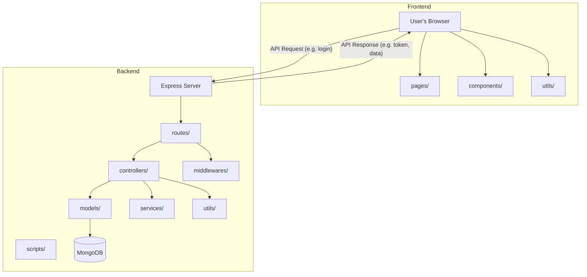

# TC-CRM Project Documentation

---

## Project Directory Structure Explanation

Your TC-CRM project is organized into two main parts:

### 1. `backend/` — The Server Side (Backend)
- Contains all code that runs on the server.
- Handles data storage, business logic, authentication, APIs, and background jobs.
- **Main subfolders and files:**
  - `controllers/` — Functions for handling API requests (e.g., add lead, login). Example: `leadController.js` manages all lead-related logic.
  - `models/` — Database schemas (structure for Users, Leads, Employees, etc.). Example: `User.js` defines what data a user has.
  - `routes/` — API endpoint definitions (e.g., `/api/leads`, `/api/auth`). Example: `authRoutes.js` defines login and registration endpoints.
  - `middlewares/` — Code that runs before controllers (e.g., authentication checks, role checks). Example: `authMiddleware.js` checks if a user is logged in.
  - `services/` — Helper services (e.g., email sending,     integration, lead distribution logic). Example: `emailService.js` sends emails for notifications.
  - `utils/` — Utility functions (e.g., phone validation, cron jobs for scheduled tasks). Example: `cronJobs.js` runs background jobs like reminders.
  - `scripts/` — Scripts for admin tasks or data fixes. Example: `addEmployee.js` can add a new employee from the command line.
  - `server.js` — The main entry point that starts the backend server, loads all routes, and connects to the database.

### 2. `frontend/` — The Client Side (Frontend)
- Contains all code that runs in the user's browser.
- Handles the user interface, user interactions, and communication with the backend.
- **Main subfolders and files:**
  - `src/pages/` — Main pages/screens (Dashboard, Leads, Login, etc.). Example: `Dashboard.jsx` shows the main dashboard with stats.
  - `src/components/` — Reusable UI parts (Header, Sidebar, Modals, Tables). Example: `LeadTable.jsx` displays a table of leads.
  - `src/utils/` — Helper functions for the frontend (e.g., notification sounds). Example: `notificationSound.js` plays a sound for new notifications.
  - `src/main.jsx` — The entry point that starts the React app and sets up routing.
  - `public/` — Static files (like images, icons, and the main HTML file).
  - `index.html` — The main HTML file loaded in the browser.

### How They Work Together
- The **frontend** is what users see and interact with in their browser. It sends requests to the backend to get or update data.
- The **backend** is the engine that stores data, checks rules, and provides APIs.
- **Example user request flow:**
  1. A user logs in from the frontend login page (`Login.jsx`).
  2. The frontend sends the login info to the backend API (`/api/auth/login`).
  3. The backend checks the credentials using `authController.js` and `User.js`.
  4. If successful, the backend sends a response (with a token) back to the frontend.
  5. The frontend stores the token and shows the dashboard.
  6. For future requests (like viewing leads), the frontend sends the token to the backend, which checks it before returning data.

---

### Visual Diagram: Project Structure & User Request Flow



---

### More Specific Example: Lead Assignment Flow

1. **Employee logs in** via the frontend (`Login.jsx`).
2. **Admin adds a new lead** using the frontend (`AddLead.jsx`), which sends a POST request to `/api/leads/led`.
3. The backend route (`leadRoutes.js`) receives the request and passes it through authentication middleware.
4. The controller (`leadController.js`) processes the new lead, saves it using the `Lead.js` model, and may trigger lead distribution logic in `services/roundRobinService.js`.
5. The backend may send a notification (using `notificationController.js` and `Notification.js` model) to the assigned employee.
6. The frontend receives confirmation and updates the UI to show the new lead and any notifications.

---

## 1. Project Overview

**TC-CRM** is a full-stack Customer Relationship Management (CRM) system for managing leads, employees, operations, payments, and notifications.

- **Backend:** Node.js, Express, MongoDB (Mongoose), Socket.io
- **Frontend:** React, Vite, Tailwind CSS

---

## 2. Backend Structure

### Technologies

- Node.js, Express.js, Mongoose (MongoDB), Socket.io, Cloudinary, Nodemailer

### Main Entry

- **server.js**  
  - Loads environment variables  
  - Connects to MongoDB  
  - Sets up Express app  
  - Applies middleware  
  - Registers all API routes  
  - Initializes Socket.io for real-time features

### Key Folders

| Folder         | Purpose                                                      |
|----------------|-------------------------------------------------------------|
| controllers/   | Business logic for each resource (auth, employee, lead, etc.)|
| models/        | Mongoose schemas for all main entities                       |
| routes/        | Express route definitions for all API endpoints              |
| middlewares/   | Auth, role, and validation middleware                        |
| services/      | Email, phone assignment, round-robin logic         |
| utils/         | Cron jobs, phone validation, etc.                            |
| scripts/       | Utility scripts for data fixes and admin tasks               |

### Main API Endpoints

| Endpoint             | Description                                  |
|----------------------|----------------------------------------------|
| `/api/auth`          | Login, register, user management             |
| `/api/leads`         | Lead CRUD, distribution, assignment, chat    |
| `/api/employees`     | Employee CRUD, status, leave, productivity   |
| `/api/operations`    | Operation user CRUD, status, activity        |
| `/api/payments`      | Payment entry, claim, verification, stats    |
| `/api/notifications` | Notification CRUD, mark as read, stats       |
| `/api/dashboard`     | Dashboard stats, follow-ups,     stats  |
| `/api/session`       | Session activity, reactivation               |

### Database Models

- **User:**  
  Admin, super-admin, advocate, with onboarding, permissions, and status fields

- **Employee:**  
  Employee-specific info, productivity, access, attendance, leave, activity logs

- **Operation:**  
  Operation user info, status, activity logs

- **Lead:**  
  All lead details, assignment, status, chat, logs, file uploads, payment claims

- **PaymentCollection:**  
  Payment details, claim/verify status, audit trail

- **Notification:**  
  Notification details, recipients, status, related data, actions

- **CallLog, SessionLog:**  
  For call and session tracking

### Special Logic

- **Lead Distribution:**  
  Assigns leads to employees/operations using round-robin and manual assignment

- **Notifications:**  
  Real-time via Socket.io, with action-required and status tracking

- **Leave & Attendance:**  
  Employees can apply for leave, admins approve/reject, attendance tracked

- **Payment Claim:**  
  Employees can claim payments, admins verify/reject

---

## 3. Frontend Structure

### Technologies

- React, Vite, Tailwind CSS, Axios, React Router, Socket.io-client

### Main Entry

- **src/main.jsx**  
  - Sets up React app  
  - Applies router  
  - Renders `App`

### Key Folders

| Folder           | Purpose                                               |
|------------------|------------------------------------------------------|
| src/pages/       | Main pages (Dashboard, Leads, Employee, etc.)        |
| src/components/  | Reusable UI components (Header, Sidebar, Modals, etc.)|
| src/utils/       | Utility functions (e.g., notification sound)         |

### Main Pages

| Page                | Description                                                                 |
|---------------------|-----------------------------------------------------------------------------|
| Dashboard           | Overview stats, follow-ups, recent activity                                 |
| Leads               | Admin/super-admin view and manage all leads; employees see only their leads |
| YourLeads           | Employee-specific page for their leads, with status updates, chat, docs     |
| Employee            | Employee management, lead distribution, approvals, productivity             |
| Operation           | Operation user management, status, client management                        |
| Claim               | Payment claim interface for employees                                       |
| LeaveApplication    | Employees apply for leave, view history                                     |
| Login/Register      | Auth pages for all user types                                               |

### Routing & Access

- Uses React Router for navigation
- Role-based access: Employees, admins, operations, advocates see different pages and features

### UI/UX

- Responsive, modern UI with Tailwind CSS
- Modals for CRUD, document upload, and details
- Real-time notifications and updates

---

## 4. Setup & Usage

### Backend

1. Install dependencies:  
   ```bash
   cd backend && npm install
   ```
2. Set up `.env` with MongoDB URI and other secrets
3. Start server:  
   ```bash
   npm start
   ```

### Frontend

1. Install dependencies:  
   ```bash
   cd frontend && npm install
   ```
2. Start dev server:  
   ```bash
   npm run dev
   ```
3. Build for production:  
   ```bash
   npm run build
   ```

---

## 5. Key Features & Workflows

### Lead Management

- Add, edit, assign, and track leads
- Employees see only their leads; admins see all
- Lead status, follow-ups, chat, and document uploads

### Employee & Operation Management

- Onboarding, status, productivity, access control
- Leave application and approval
- Manual and automatic lead distribution

### Payment Collection & Claim

- Payment entries linked to leads
- Employees claim payments, admins verify
- Payment status tracked and notified

### Notification System

- Real-time notifications for actions (lead assignment, payment, leave, etc.)
- Mark as read, archive, action-required notifications

### Security & Access

- JWT-based authentication
- Role-based access control (admin, super-admin, employee, operation, advocate)
- IP whitelisting for sensitive roles

---

## 6. Special Logic

- **Round Robin Lead Assignment:**  
  Ensures fair distribution of leads among employees/operations.

- **Socket.io Real-Time Updates:**  
  For notifications and status changes.

- **Cloudinary Integration:**  
  For document and image uploads.

- **Cron Jobs:**  
  For scheduled tasks (e.g., reminders, status updates).

---

## 7. Scripts & Utilities

- **Scripts:**  
  For admin tasks, data fixes, and migrations (see `backend/scripts/`)

- **Utils:**  
  Phone validation, cron jobs, etc.

---

## 8. Extending & Customizing

- Add new roles or permissions in `User` and `Employee` models
- Add new notification types in `Notification` model and controller
- Extend lead/payment fields as needed in their respective models

---

**This documentation covers the full technical structure and main flows of TC-CRM.  
If you need a PDF or further formatted version, let me know!** 
